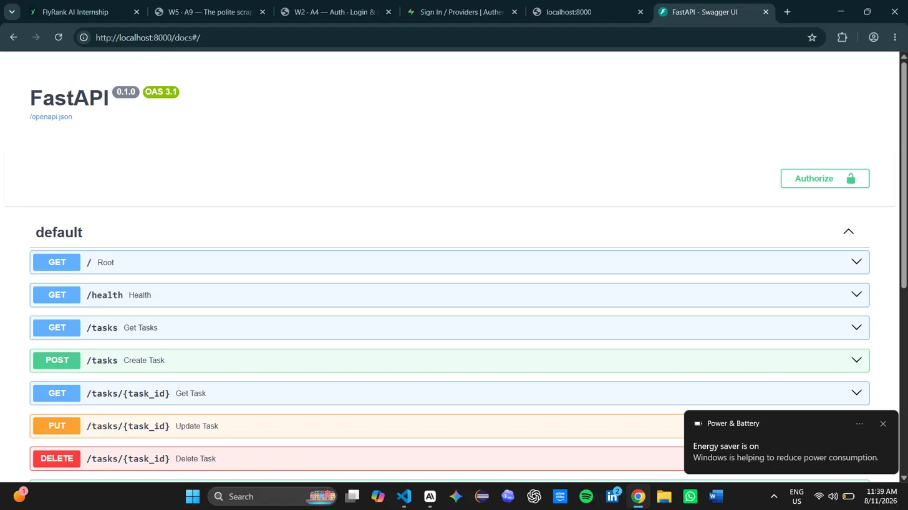

# FlyRank Task API

A REST API built with FastAPI for managing tasks with Supabase authentication.

## How to run

venv\Scripts\activate
python -m uvicorn main:app --reload

## Environment Variables

Copy `.env.example` to `.env` and fill in your values:

SUPABASE_URL=your_project_url
SUPABASE_KEY=your_anon_key

## Endpoints

| Method | Endpoint | Auth | Description |
|--------|----------|------|-------------|
| GET | / | No | API info |
| GET | /health | No | Health check |
| GET | /tasks | No | Get all tasks |
| GET | /tasks/{id} | No | Get one task |
| POST | /tasks | No | Create a task |
| PUT | /tasks/{id} | No | Update a task |
| DELETE | /tasks/{id} | No | Delete a task |
| POST | /auth/signup | No | Create account |
| POST | /auth/login | No | Login |
| POST | /auth/logout | Yes | Logout |
| GET | /public/info | No | Public info |
| GET | /protected/profile | Yes | Your profile |
| GET | /protected/dashboard | Yes | Dashboard |

## Swagger UI

Visit http://localhost:8000/docs — click Authorize and paste your token to test protected routes.

[]