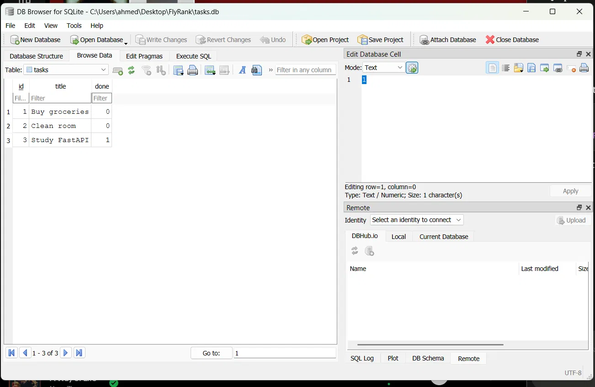

# Task API

A simple REST API to manage a to-do list built with FastAPI.

## How to run

```bash
venv\Scripts\activate
uvicorn main:app --reload
```

## Endpoints

| Method | Endpoint | Description |
|--------|----------|-------------|
| GET | /tasks | Get all tasks |
| GET | /tasks/{id} | Get one task |
| POST | /tasks | Create a task |
| PUT | /tasks/{id} | Update a task |
| DELETE | /tasks/{id} | Delete a task |

## Example

```bash
curl -i http://localhost:8000/tasks
```

## Swagger UI

Visit http://localhost:8000/docs to test all endpoints interactively.

## Database

This project uses SQLite to store tasks persistently in a file called `tasks.db`.

- Zero setup — the database file is created automatically on first run
- Data survives server restarts
- Chosen because it's lightweight, serverless, and requires no installation

## Example SQL query

```sql
SELECT * FROM tasks WHERE done = 1;
```
This returns all completed tasks directly from the database.

## DB Browser screenshot

[]